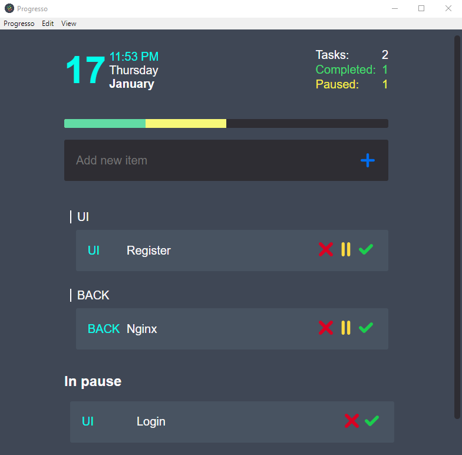

# Progresso 

Group and progress based To-Do list.
Enhanced version of [todometer](http://cassidoo.github.io/todometer) latest release (1.0.4)



## New features

 Progresso aims to boost cassidoo's tool functions while keeping the _simple_ perk.
 You can:

 - Create task groups, names are limited to 4 characters and default to NEW if left blank
 ```
 group-name:task-name
 UI:Login page
 ```
 - Visualize total, paused and completed tasks
 - Visualize the date in a more compact way

## Development

### Run it yourself

- Clone the repo:
```
git clone https://github.com/LochiQF/Progresso.git
```

- Install dependencies:
```
cd Progresso && npm install
```

- Run `npm start`.


### Build Progresso

 - Windows
 ```
 npm run package-win
 npm run build:win
 ```

 - OSX
 ```
 npm run package-mac
 npm run build:mac
 ```


### Contributing

Contributing to Progresso is currently not available.

If you're really interested in contributing I'd advise you to head up to the original project, it's well maintained and clearly coded.

## Credits

Button icons made by Freepik from www.flaticon.com, part of the UI Essentials pack.

Idea of [cassidoo](https://github.com/cassidoo)
